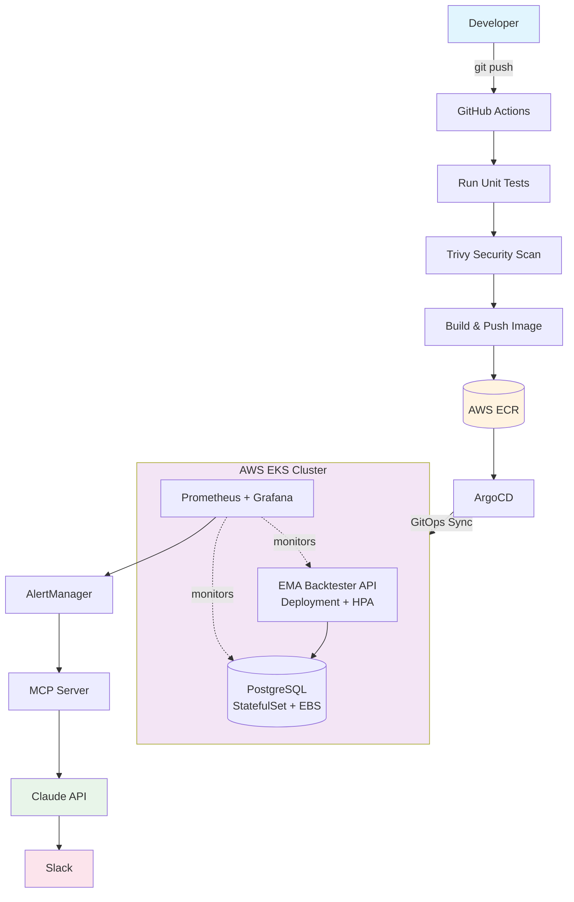

# EMA Crossover Backtester — DevOps Portfolio Project

A production-grade DevOps portfolio project built on a real EMA (Exponential Moving Average) 
crossover trading strategy for Indian financial markets (Nifty 50, BankNifty).

The application serves as a vehicle to demonstrate end-to-end DevOps practices — 
from containerization to GitOps deployment, autoscaling, observability, and AI-assisted operations.

---

## Architecture
## Architecture


## Tech Stack

| Category | Technology |
|----------|-----------|
| **Language** | Python 3.14 |
| **Financial Data** | yfinance (real NSE market data) |
| **Testing** | pytest (BDD-style unit tests) |
| **Containerization** | Docker (multi-stage, non-root, pinned digest) |
| **Registry** | AWS ECR (with vulnerability scanning) |
| **CI/CD** | GitHub Actions (test → scan → build → push) |
| **GitOps** | ArgoCD |
| **Orchestration** | Kubernetes (AWS EKS) |
| **IaC** | Terraform |
| **Monitoring** | Prometheus, Grafana, AlertManager |
| **Logging** | AWS CloudWatch (Container Insights) |
| **Security** | Trivy, RBAC, NetworkPolicy, non-root containers |
| **Database** | PostgreSQL (persistent, EBS-backed) |
| **Cloud** | AWS (EKS, ECR, CloudWatch, IAM, EBS, VPC) |

---

## Project Structure

devops-project-1/
├── app.py # Web API (backtester as HTTP service)
├── backtester.py # Batch EMA crossover backtester
├── generate_data.py # Real Nifty data via yfinance
├── test_backtester.py # Unit tests (BDD style, 8 tests)
├── requirements.txt # Python dependencies
├── Dockerfile # Multi-stage, non-root container
├── .dockerignore # Excludes non-app files from image
├── k8s/ # Kubernetes manifests
│ ├── deployment.yaml # App deployment with initContainer
│ ├── service.yaml # ClusterIP service
│ ├── hpa.yaml # Horizontal Pod Autoscaler
│ ├── rbac.yaml # ServiceAccount + least-privilege Role
│ ├── configmap.yaml # Non-sensitive configuration
│ ├── network-policy.yaml # Pod-level firewall rules
│ ├── pdb.yaml # Pod Disruption Budget
│ ├── prometheus-rules.yaml # SLO alerting rules
│ └── argocd-app.yaml # ArgoCD application definition
├── terraform/ # Infrastructure as Code
│ └── main.tf # Kubernetes provider + Job resource
├── .github/workflows/
│ └── docker-build.yml # CI/CD pipeline
└── learning/ # Python fundamentals (reference)


---

## API Endpoints

| Endpoint | Method | Description |
|----------|--------|-------------|
| `/health` | GET | Health check — returns `{"status": "healthy"}` |
| `/backtest` | GET | Run EMA crossover backtest on real Nifty data, save to DB |
| `/results` | GET | Retrieve historical backtest results from PostgreSQL |

---

## Backtesting Strategy

- **Index:** Nifty 50 (`^NSEI`) — real data via Yahoo Finance
- **Strategy:** 9/21 EMA crossover
- **Buy signal:** 9 EMA crosses above 21 EMA (golden cross)
- **Sell signal:** 9 EMA crosses below 21 EMA (death cross)
- **Backtest period:** 1 year of daily candles
- **Results stored:** PostgreSQL with timestamp for historical analysis

**Real backtest result (Jul 2025 — Jul 2026):**
- Total trades: 9 | Winners: 1 | Win rate: 11.11%
- Note: Low win rate reflects choppy/ranging Nifty market in 2025-2026
- The one winning trade (Oct-Dec 2025) caught the genuine uptrend to 26,328

---

## SLOs (Service Level Objectives)

| SLO | SLI | Target |
|-----|-----|--------|
| Availability | % of `/health` requests returning 200 | 99.5% |
| Latency | p99 response time of `/backtest` | < 3 seconds |
| Pod availability | Available replicas | ≥ 1 at all times |

---

## How to Run Locally

```bash
# Install dependencies
pip install -r requirements.txt

# Fetch real Nifty data and run backtest
python generate_data.py
python backtester.py

# Run tests
pytest test_backtester.py -v

# Build Docker image
docker build -t ema-backtester:latest .

# Run container
docker run -p 8000:8000 ema-backtester:latest
```

---

## How to Deploy to EKS

```bash
# Create EKS cluster
eksctl create cluster \
  --name ema-backtester-cluster \
  --region ap-south-1 \
  --node-type t3.small \
  --nodes 2 --managed

# Update kubeconfig
aws eks update-kubeconfig --region ap-south-1 --name ema-backtester-cluster

# Install ArgoCD
kubectl create namespace argocd
kubectl apply -n argocd -f https://raw.githubusercontent.com/argoproj/argo-cd/stable/manifests/install.yaml

# Install PostgreSQL
helm install postgres bitnami/postgresql \
  --set auth.username=backtester \
  --set auth.password=backtester123 \
  --set auth.database=backtestdb

# Apply ArgoCD app (auto-deploys all k8s/ manifests)
kubectl apply -f k8s/argocd-app.yaml

# Remember to delete cluster when done to avoid costs
eksctl delete cluster --name ema-backtester-cluster --region ap-south-1
```

---

## CI/CD Pipeline

Every push triggers automatically:

Push to develop → Tests + Trivy scan
Push to master → Tests + Trivy scan + Build + Push to ECR (tagged with git SHA)
Pull Request → Tests + Trivy scan (quality gate before merge)


---

## Key DevOps Concepts Demonstrated

- **GitOps:** ArgoCD syncs cluster state from Git — Git is the single source of truth
- **Least privilege:** Dedicated ServiceAccount with scoped RBAC Role
- **Defense in depth:** Non-root containers + NetworkPolicy + Trivy scanning + RBAC
- **Immutable builds:** Docker images pinned to SHA256 digest, tagged with git SHA
- **SLO-driven operations:** Prometheus rules alert on SLO breaches
- **Infrastructure as Code:** Terraform manages K8s resources declaratively

---

## Author

Sharath Kumar | nagamsharathkumar9@gmail.com  
GitHub: [nagamsharathkumar9-spec](https://github.com/nagamsharathkumar9-spec)